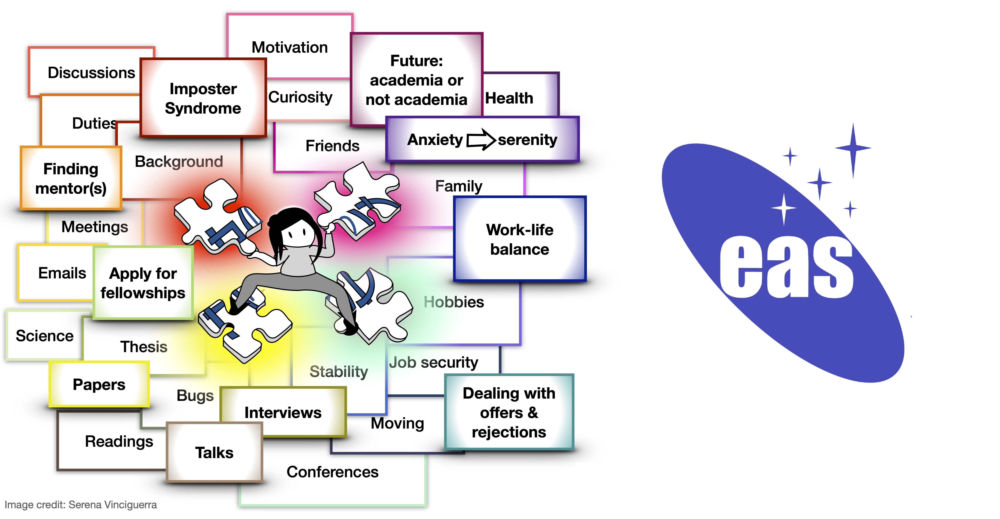



Supporting Early Career Astronomers 
======

To promote EDI in astronomy, mental health, and career development of early career astronomers (ECA) we have collected resources and organise yearly ECA meetings at the European Astronomical Society Annual Meeting (EAS). The goal of these meetings is to connect early career astronomers and learn how to thrive in an academic environment.

  

These are some resources we have gathered from the talks and discussions at the EAS Annual Meeting Session SS31: Early Career Astronomers and their Supporters:

* Wellbeing and welfare blogs & podcasts: [https://voicesofacademia.com/](https://voicesofacademia.com/), [https://astrobites.org/2019/08/23/mental-health-in-grad-school-2/](https://astrobites.org/2019/08/23/mental-health-in-grad-school-2/) , [https://podcasts.apple.com/gb/podcast/self-care-with-drs-sarah/id1029803533](https://podcasts.apple.com/gb/podcast/self-care-with-drs-sarah/id1029803533), [https://www.zjayres.com/posters?fbclid=IwAR3nCmR6iT0bgHGccN9dYkm9YwxONKNFXdhTFlAmvTJLRSvSV322qPisVvQ](https://www.zjayres.com/posters?fbclid=IwAR3nCmR6iT0bgHGccN9dYkm9YwxONKNFXdhTFlAmvTJLRSvSV322qPisVvQ)  
* Support and Mentoring:
[https://www.science.org/content/article/person-career-gps](),
[https://recastronomia.github.io/mentores/](https://recastronomia.github.io/mentores/), [https://www.astroreca.org/en 
https://www.astrobetter.com/blog/2021/09/21/setting-expectations-for-research-students/](https://www.astroreca.org/en 
https://www.astrobetter.com/blog/2021/09/21/setting-expectations-for-research-students/). Example of mentoring contract by Viviana Acquaviva:
[https://docs.google.com/document/d/15HAXTqpSirjLOtF7jif4fAjZHNCzp3_FIpztFDtOCzM/edit?usp=sharing](https://docs.google.com/document/d/15HAXTqpSirjLOtF7jif4fAjZHNCzp3_FIpztFDtOCzM/edit?usp=sharing)
* Resources for women in STEM: [http://www.sarahrugheimer.com/Women_in_STEM_Resources.html](http://www.sarahrugheimer.com/Women_in_STEM_Resources.html) 
* Books: "Managing your mental health during your PhD" [https://www.zjayres.com](https://www.zjayres.com), "Every other Thursday" [https://www.jstor.org/stable/j.ctt1nq696](https://www.jstor.org/stable/j.ctt1nq696)

Support groups:
* Facebook group for Early career astronomers and astrophysicists: [https://www.facebook.com/groups/582367049172861](https://www.facebook.com/groups/582367049172861)

Big thanks to the ECA SOC 2021/2022: Floor Broekgaarden, Jakob van den Eijnden, Annelotte Derkink, Neige Frankel, Serena Vinciguerra, Anjali Piette, Valeriya Korol, Anniek Gloudemans

And senior advising board 2021/2022 (in reversed alphabetical order): 
David Weir, Silvia Toonen, Dorottya Szécsi, Enrico Ramirez-Ruiz, Samaya Nissanke, Ewine van Dishoeck
