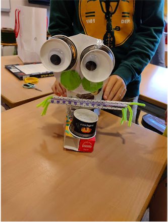
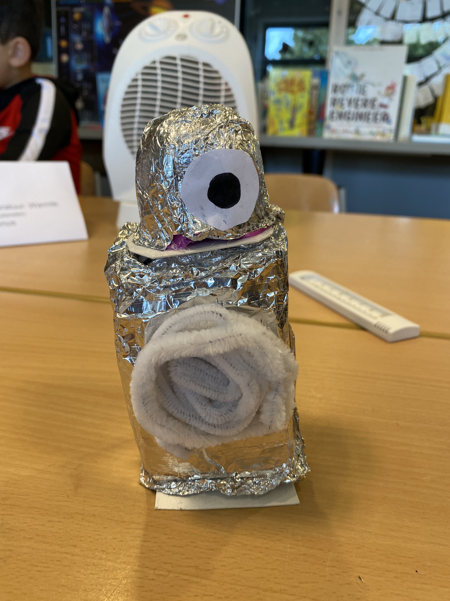
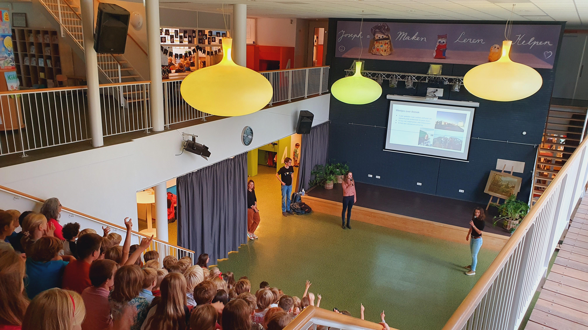
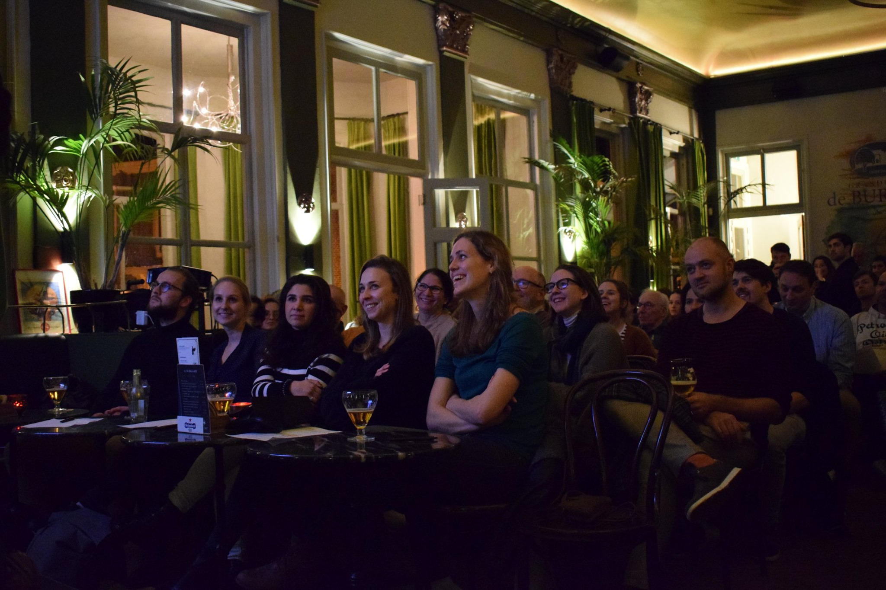
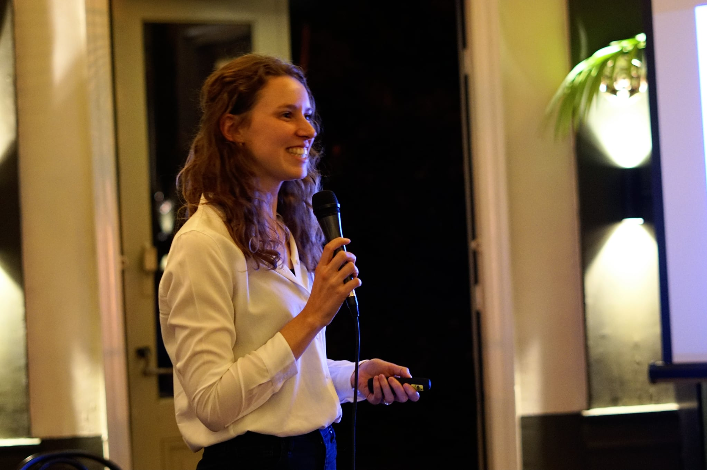



Life in the Universe: using astronomy to teach primary school children about climate change 
======
As a part of the sustainability committee at the Leiden Observatory in The Netherlands, we have developed a 5-day lesson program designed for primary school students (9-12 years old). The main aim of this project is to fascinate children about the Universe and make them realise how unique our Earth and climate are from a cosmic perspective. Education about the climate crisis is an urgent topic on the Sustainable Development Goals agenda and highly relevant for schools in the Netherlands. Astronomy is a powerful tool to fascinate children about our Universe and offers a new perspective on the climate discussion by making them realise how unique our Earth is compared to other uninhabitable planets and why we have to protect it.

The idea is that we achieve our goals through play. The children work in groups, over the course of 5 lessons. Each group is assigned to a planet or moon in the Solar System and is asked to design and to build an alien that can live on it (based on a workshop from AstroEdu). For the first part of their activity they will be actively gathering information about the planet/moon assigned to them. Once they know enough, they will start the design and construction of the aliens. For the second part of the activity, once the aliens are finished, they will then have to test the survivability of their alien using testing stations to mimic for example cold, wind, or high gravity.

Our pilot project has been very successful and with the support from the ET Outreach award (see [https://khmw.nl/outreach-award/](https://khmw.nl/outreach-award/)) we have been able to further develop the lesson material, which will be made available online for everyone to use in the near future (see [https://www.universiteitleiden.nl/leven-in-het-heelal/over-leven](https://www.universiteitleiden.nl/leven-in-het-heelal/over-leven)).

  
  
   

Astronomy on Tap Leiden 
======
We organise monthly events at Grand Cafe the Burcht in Leiden to promote astronomy research amongst the general public. During these events we invite astronomy researchers to explain their work in an informal setting, which allows for conversations between the researchers and interested guests. Every month we organise this event with a different topic ranging from astro-chemistry to exoplanets and cosmology. Besides the talks we always make games to encourage people to interact with each other and the scientists to allow for open discussion. For latest events check our website: [https://astronomyontap.org/locations/leiden-the-netherlands/](https://astronomyontap.org/locations/leiden-the-netherlands/).

  
   

List of public talks and events:
======

* Nov. 2022: Teaching workshop "Life in the Universe" at Basisschool de Voorsprong in Den Haag 
* October 2022: Interview for Radio Weetlust [https://sleutelstad.nl/programma/radio-weetlust/uitzending/2022-09-28/](https://sleutelstad.nl/programma/radio-weetlust/uitzending/2022-09-28/)
* Dec. 2021: Talk at MuseumJeugdUniversiteit at Sonnenborg Observatory - Het vroege Universum 
* Sep 2021: Teaching workshop "Life in the Universe" at St. Joseph school in Leiden
* Aug. 2020: Talk for Astronomy on Tap Leiden [https://www.youtube.com/@AstronomyonTapLeiden/videos](https://www.youtube.com/@AstronomyonTapLeiden/videos)
* 2019 - present: Organiser Astronomy on Tap Leiden [https://astronomyontap.org/locations/leiden-the-netherlands/](https://astronomyontap.org/locations/leiden-the-netherlands/)
* Sep. 2018 - Jul. 2019: Altair project at Anton Pannekoek Institute, teaching astronomy to primary school children in collaboration with Prof. Sera Markoff
* Dec. 2018 - Jul. 2019: Vrijland project at University of Amsterdam, teaching star gazing classes for primary school children
* 2017 - 2019: guiding public tours at the Anton Pannekoek Observatory 

