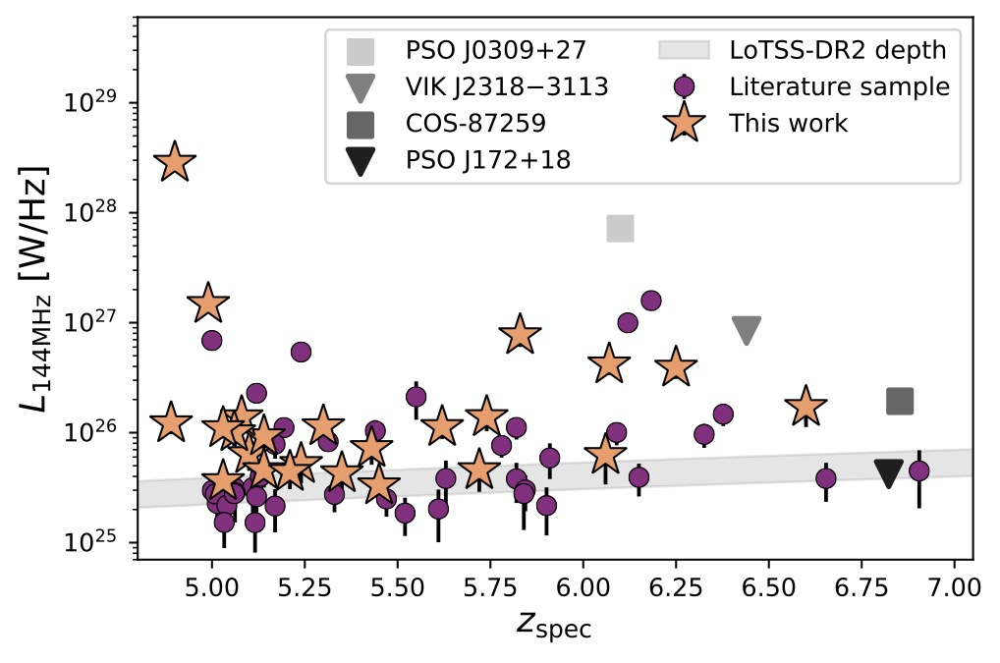



Low-frequency properties of quasars into the Epoch of Reionization
======

High redshift radio-loud active galactic nuclei (AGN) are extremely useful tools for studying the formation and evolution of supermassive black holes in the early Universe and constraining when and how the Universe made a phase transition from neutral to ionised, which remains a paramount goal of modern astrophysics. Radio bright sources at z>6 are unique beacons against which absorption by the neutral gas that pervaded the very early Universe can be seen in the HI 21cm line. However, these are extremely rare and with the discovery of hundreds of quasars at z>6 in optical surveys, only a handful shine bright at low-frequency radio wavelengths. 

Recently, the LOFAR Two Metre Sky Survey (LoTSS) opened up a new wavelength regime to perform the first statistical study of the low-frequency properties of quasars into the Epoch of Reionization (EoR). In our study of a sample of 115 known spectroscopically confirmed quasars at z>5, we found that 36% of the quasars are tentatively detected by LOFAR with median radio spectral index comparable to the quasar population at z<3 and no proof for evolution in the radio loudness distribution. This work highlights the capabilities of the new generation of low-frequency radio surveys in detecting a significant part of the quasar population at high-redshift. 

  
  
  <figcaption>Left: THe LOFAR superterp located in the Netherlands. LOFAR is reaching unprecendented depth and area coverage at low-frequencies (<200 MHz). Right: A luminous quasar (z=6.12) within the first billion years of cosmic history detected by LOFAR at 144 MHz. LOFAR can tentatively detect ~30% of the quasar popupulation at z>5 (~1 million years after the big bang). </figcaption>

Discovery of radio-loud quasars
======

Finding radio-loud quasars and radio galaxies at z>6 within the immense radio galaxy population is challenging and currently only a few radio bright sources above z>6 are known. To increase the number statistics and lay the groundwork for future EoR studies, we have started a campaign to search for radio-detected quasars at z>5 using the newly-released radio data from the LOFAR Two-metre Sky Survey (Shimwell+2022) combined with archival optical (DESI Legacy Imaging Survey) and near-infrared data. 

Our search has more than doubled the number of known radio-bright quasars at z>5 (Gloudemans+2022). Our campaign demonstrates the potential for discovering new (faint) high-z quasar populations through next generation radio continuum surveys by efficiently select high-redshift quasars (with a success rate of 33%) and reducing the number of stellar contaminants in the sample.

Our sample probes a unique parameter space by going to fainter optical luminosity and brighter radio luminosity than the currently known sample of high-z quasars. Both the optical and near-infrared colours and Lyman alpha equivalent width do not deviate from the known quasar population, thereby strengthening the case against a bi-modality in the radio-loudness distribution of the quasar population. 

  
  
  
  <figcaption> Left: Radio luminosity at 144 MHz of our newly discovered quasar sample using LOFAR and literature quasars. Right: The spectrum of a radio-loud quasar in the EoR at z=6.25 with strong Lya emission and radio emission discovered using Subaru/FOCAS. </figcaption>

Unveiling radio-loud AGN populations with WEAVE-LOFAR
======

The building of statistical sample of radio AGN at high-redshift will be vital to gain an understanding of how the first radio jets are triggered, how they evolve and what impact they have on galaxy evolution and their environment. A novel approach to finding new high redshift radio sources will be taken by the WEAVE-LOFAR survey (Smith+2016), which will take ~1 million optical spectra of LOFAR detected sources and enable the detection of hundreds of radio AGN at 5<z<6.5. 

WEAVE-LOFAR wide tier will observe LOFAR detected sources above 8 mJy and is expected to detect Lya emitters with luminosities > 10^43 erg/s at z~5, which are expected to include both radio galaxies and quasars. The most radio-bright sources can be used by LOFAR now or by SKA in the near-future to directly measure the neutral hydrogen content in the EoR via the 21-cm absorption line. 

WEAVE is a multi-object spectrograph on the William Herschel Telescope on La Palma and is expected to start survey operations in early 2023. First-light observations have already been carried out using the large integral-field unit: [https://www.ing.iac.es/PR/press/weave_LIFU_first_light.html](https://www.ing.iac.es/PR/press/weave_LIFU_first_light.html). The multi-object spectrograph consists of ~1000 individual fibers with a 2 sqr. deg field of view and wavelength coverage of 360-970 nm (spectral resolution of 5000 & 20000). 

  
  
  <figcaption>Left: The WEAVE positioner consisting of ~1000 individual fibers (Credit: Isaac Newton Group of Telescopes (ING), La Palma.). Right: The William Herschel Telescope on La Palma will conduct ~5 years of WEAVE surveys. </figcaption>

Re-evaluation of Lunar X-ray observations by Apollo 15 & 16
======

The Apollo mission to the moon have been transformational for both space technology and studies of the Lunar surface and its formation history. To measure the chemical composition of the Lunar surface, the Apollo 15 & 16 mission have carried remote sensing instruments on the commando service module (CSM), operating at gamma- and X-ray wavelengths. These experiments have resulted in tens of publications, but now more than 50 years later the advancements of physical models and knowledge on the moon can put this work into a new light. 

Therefore, we have re-evaluated the X-ray fluorescence experiments onboard Apollo 15 & 16, which orbited the moon for 5 days and have covered about 10% of the Lunar surface, using  an updated instrument response, a newly reconstructed Lunar trajectory orbit, and improved intensity ratio calculations. Our work resulted in new intensity ratio maps of Al/Si, Mg/Si, and Mg/Al, with average values of Al/Si of ~30% lower than found in the original papers.  Comparing these intensity ratios with optical maps show geological features have distinguished chemical characteristics, with the mare regions being signified by lower Al/Si values than the highlands. 

  
  
  
  <figcaption> Left: New map of aluminum over silicon density of Lunar surface as measured by the Apollo 15 & 16 missions. Right: ESA project scientist Erik Kuulkers with astronaut Alfred Worden who conducted the X-ray observations on the Apollo 15 flight. </figcaption>

